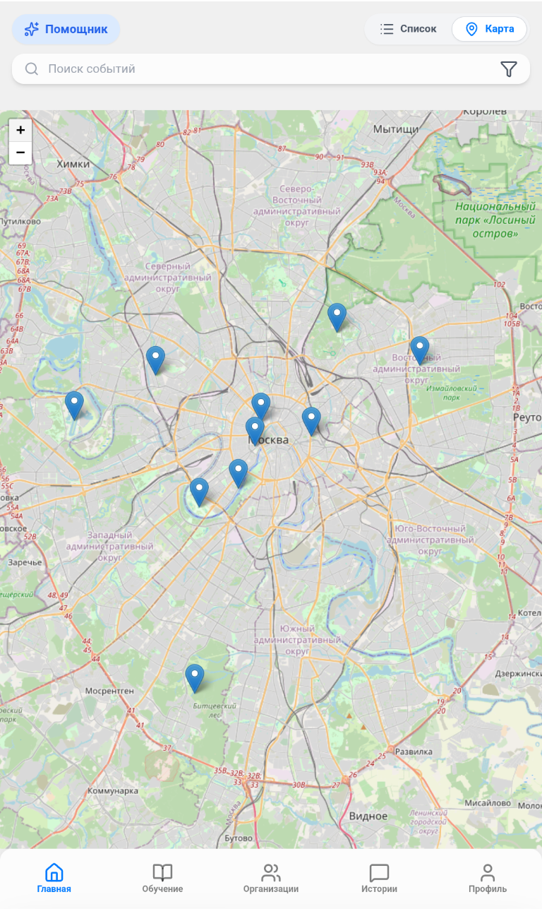
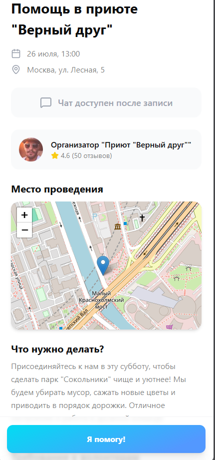
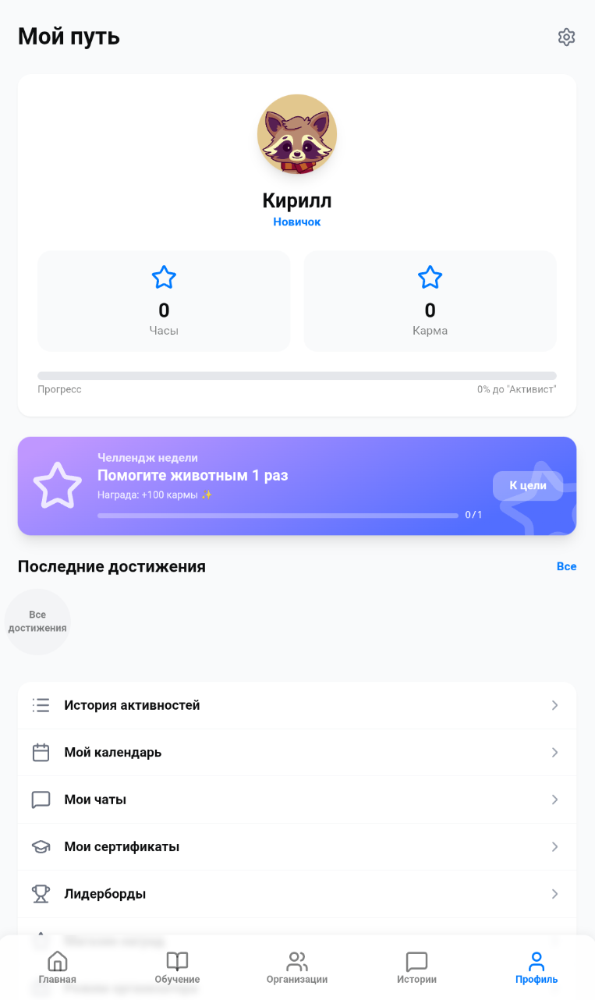
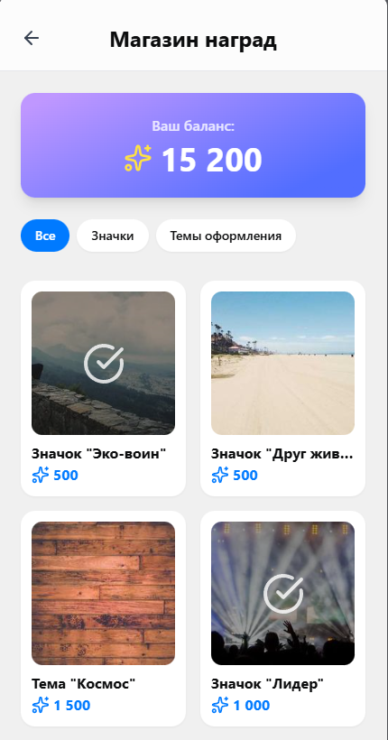
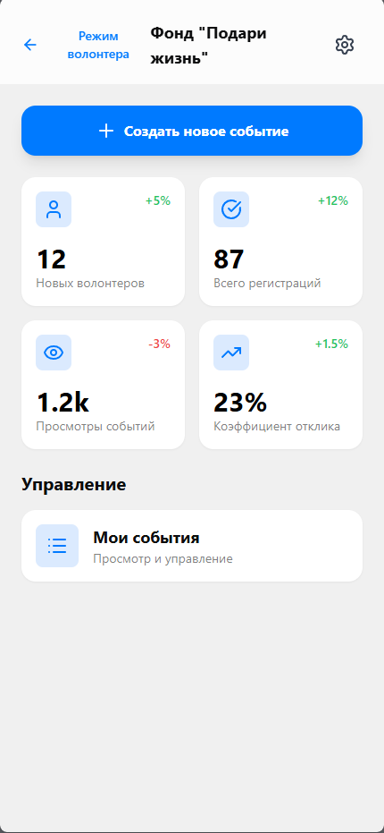
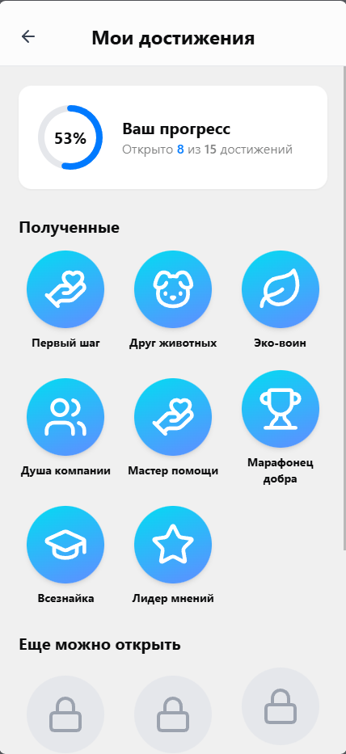

# Проект "MAX Добро"

[Русский](./README.ru.md) | [English](./README.md)

<!-- Здесь можно разместить логотип или баннер проекта -->
<p align="center">
  
</p>

> Полнофункциональная платформа для волонтеров и благотворительных организаций, созданная для геймификации добрых дел и
> построения активного сообщества.

<p align="center">
  
  
  
  
</p>

---

## 📖 Оглавление

- [✨ О проекте](#-о-проекте)
- [📸 Скриншоты](#-скриншоты)
- [🚀 Основные возможности (Features)](#-основные-возможности-features)
    - [Для волонтеров](#для-волонтеров)
    - [Для организаторов](#для-организаторов)
    - [Общие функции](#общие-функции)
- [🛠️ Технологический стек и архитектура](#️-технологический-стек-и-архитектура)
    - [Архитектура](#архитектура)
    - [Backend](#backend)
    - [Frontend](#frontend)
    - [Chat Bot](#chat-bot)
- [⚙️ Быстрый старт и запуск](#️-быстрый-старт-и-запуск)
    - [Требования](#требования)
    - [1. Клонирование репозитория](#1-клонирование-репозитория)
    - [2. Конфигурация окружения (.env)](#2-конфигурация-окружения-env)
    - [3. Запуск с помощью Docker Compose](#3-запуск-с-помощью-docker-compose)
    - [4. Миграции и наполнение БД](#4-миграции-и-наполнение-бд)
- [🚶‍♂️ Пользовательские сценарии (User Scenarios)](#️-пользовательские-сценарии-user-scenarios)
    - [Сценарий 1: Новый волонтер ищет первое событие](#сценарий-1-новый-волонтер-ищет-первое-событие)
    - [Сценарий 2: Организатор создает и управляет событием](#сценарий-2-организатор-создает-и-управляет-событием)
- [👨‍💻 Руководство для разработчиков](#-руководство-для-разработчиков)
    - [Структура проекта](#структура-проекта)
    - [Основные скрипты](#основные-скрипты)
    - [Тестирование](#тестирование)
- [☁️ Развертывание (Deployment)](#️-развертывание-deployment)
- [👥 Авторы и контакты](#-авторы-и-контакты)
- [📜 Лицензия](#-лицензия)

---

## ✨ О проекте

**MAX Добро** — это веб-приложение, созданное для объединения людей, желающих делать добрые дела, и организаций,
нуждающихся в помощи. Платформа не только служит доской объявлений для волонтерских мероприятий, но и добавляет элементы
геймификации и социальной сети для повышения вовлеченности.

**Ключевые цели проекта:**

- **Упростить** поиск волонтерских активностей.
- **Мотивировать** пользователей через систему кармы, достижений и наград.
- **Обучать** волонтеров через встроенные курсы и тесты.
- **Создать сообщество** с помощью историй, комментариев и системы друзей.
- **Предоставить** удобные инструменты для организаторов мероприятий.

---

## 📸 Скриншоты

*Здесь разместите несколько ключевых скриншотов приложения, чтобы наглядно показать его интерфейс.*

|      Главный экран       |       Детали события       |   Профиль пользователя    |
|:------------------------:|:--------------------------:|:-------------------------:|
|  |  |  |

|      Магазин наград       |     Панель организатора      |        Достижения         |
|:-------------------------:|:----------------------------:|:-------------------------:|
|  |  |  |

---

## 🚀 Основные возможности (Features)

### Для волонтеров

- **Лента и карта событий:** Поиск мероприятий в виде списка или на интерактивной карте.
- **Геймификация:**
    - **Очки кармы и часы добра:** Зарабатываются за участие в событиях.
    - **Достижения ("Ачивки"):** Выдаются за выполнение определенных целей.
    - **Магазин наград:** Возможность потратить карму на виртуальные предметы.
    - **Еженедельные челленджи:** Дополнительные задания для получения бонусов.
- **Обучение:** Встроенные курсы с тестами и возможностью получить сертификат.
- **Социальные функции:**
    - **Лента историй:** Делитесь впечатлениями с мероприятий.
    - **Друзья, лайки, комментарии:** Взаимодействуйте с другими волонтерами.
- **Профиль:** Отслеживайте свой прогресс, статистику, достижения и сертификаты.
- **Подписки:** Следите за новостями любимых организаций.

### Для организаторов

- **Панель управления:** Удобный интерфейс для управления деятельностью организации.
- **Создание и управление событиями:** Полный цикл от черновика до публикации.
- **Управление участниками:** Подтверждение и отклонение заявок волонтеров.
- **Статистика:** Аналитика по подписчикам, событиям и рейтингу.

### Общие функции

- **Аутентификация:** Бесшовный вход через платформу MAX и стандартная регистрация через Supabase (email/пароль).
- **AI-помощник:** Чат-бот для быстрой навигации и поиска информации.
- **Рейтинги (Лидерборды):** Соревнуйтесь с другими волонтерами за звание самого активного.

---

## 🛠️ Технологический стек и архитектура

### Архитектура

Проект построен на микросервисной (в данном случае, сервисно-ориентированной) архитектуре и состоит из трех независимых
частей:

1. **Backend (API):** Ядро приложения, обрабатывающее всю бизнес-логику.
2. **Frontend (Mini App):** Клиентское приложение, с которым взаимодействует пользователь.
3. **Chat Bot:** Точка входа для пользователей платформы MAX.

*Здесь можно вставить простую диаграмму архитектуры.*

```

[Пользователь] <--> [MAX Platform] <--> [Chat Bot]
|
+-----> [Frontend (Mini App)] <--> [Backend API] <--> [PostgreSQL (Supabase)]
^
|
[Supabase Auth (Webhooks)]

```

### Backend

- **Фреймворк:** **NestJS** (Node.js)
- **Язык:** **TypeScript**
- **База данных:** **PostgreSQL** (управляется через **Supabase**)
- **ORM:** **Prisma**
- **Аутентификация:** **Supabase Auth** + **JWT** + **MAX Auth**
- **API:** **REST API** с документацией **Swagger**

### Frontend

- **Фреймворк:** **React**
- **Сборщик:** **Vite**
- **Язык:** **TypeScript**
- **Стилизация:** **Tailwind CSS**
- **Карты:** **Leaflet** + **React Leaflet**

### Chat Bot

- **Платформа:** **MAX Bot API**
- **Среда:** **Node.js** + **TypeScript**

---

## ⚙️ Быстрый старт и запуск

### Требования

- **Docker** и **Docker Compose**
- **Node.js** (v20+) и **npm**
- **Git**

### 1. Клонирование репозитория

```bash
git clone https://github.com/ShutovKS/MAX-Dobro.git
cd MAX-Dobro
```

### 2. Конфигурация окружения (.env)

Создайте `.env` файлы в каждой из папок (`backend`, `frontend`, `chat-bot`) на основе `*.env.example` файлов.

#### `backend/.env` (Подробное описание)

* `PORT`: Порт для бэкенд-сервера. **3001** — стандартное значение.
* `MAX_BOT_TOKEN`: Токен вашего бота из платформы MAX. Нужен для валидации входа через MAX.
* `MINI_APP_URL`: URL вашего развернутого фронтенд-приложения.
* `JWT_INTERNAL_SECRET`: Секретный ключ для подписи внутренних JWT. Сгенерируйте командой `openssl rand -base64 32`.
* `DATABASE_URL`: Строка подключения к вашей базе данных Supabase (Project Settings -> Database -> Connection string ->
  URI). **Добавьте `?pgbouncer=true` в конец для лучшей производительности.**
* `DIRECT_URL`: То же самое, что и `DATABASE_URL`.
* `SUPABASE_URL`: URL вашего проекта Supabase (Project Settings -> API -> Project URL).
* `SUPABASE_ANON_KEY`: Анонимный публичный ключ Supabase (Project Settings -> API -> Project API Keys).
* `SUPABASE_WEBHOOK_SECRET`: Придумайте любую секретную строку. Ее нужно будет указать в настройках вебхука в Supabase (
  Database -> Webhooks).

#### `frontend/.env`

* `VITE_API_BASE_URL`: URL вашего локального бэкенда (например, `http://localhost:3001`).
* `VITE_API_MODE`: Установите `real` для работы с бэкендом или `mock` для использования моковых данных.
* `VITE_SUPABASE_URL`: URL вашего проекта Supabase.
* `VITE_SUPABASE_ANON_KEY`: Анонимный публичный ключ Supabase.

#### `chat-bot/.env`

* `BOT_TOKEN`: Токен бота от платформы MAX
* `BOT_NAME`: Ник бота в MAX без @

### 3. Запуск с помощью Docker Compose

Этот файл запускает все три сервиса (без локальной БД, так как используется Supabase).

```bash
docker-compose up --build -d
```

- **Frontend** будет доступен по адресу: `http://localhost:3000`
- **Backend API** будет доступен по адресу: `http://localhost:3001`
- **Swagger Docs** будут доступны по адресу: `http://localhost:3001/api/docs`

### 4. Миграции и наполнение БД

После первого запуска контейнеров примените миграции и наполните базу данных.

```bash
# Применить миграции к базе данных Supabase
docker-compose exec backend npm run migrate:dev

# (Опционально) Наполнить базу тестовыми данными
docker-compose exec backend npm run seed
```

---

## 🚶‍♂️ Пользовательские сценарии (User Scenarios)

### Сценарий 1: Новый волонтер ищет первое событие

1. Пользователь регистрируется в приложении через Supabase или входит через MAX.
2. Проходит короткий онбординг, выбирая интересующие его направления (например, "Экология", "Животные").
3. На главном экране видит карту с ближайшими событиями и ленту мероприятий.
4. Находит "Субботник в парке", открывает детали, читает требования.
5. Нажимает "Я помогу", подтверждает участие.
6. После мероприятия оставляет отзыв и получает очки кармы, часы и, возможно, первое достижение.

### Сценарий 2: Организатор создает и управляет событием

1. Пользователь с ролью `organization` входит в систему. Его перенаправляет в панель управления.
2. Нажимает "Создать событие", заполняет все поля: название, описание, дата, место, требования.
3. Публикует событие. Оно появляется в общей ленте у волонтеров.
4. В разделе "Управление событиями" отслеживает новые заявки.
5. Просматривает профили волонтеров и подтверждает их участие.
6. После проведения мероприятия чат события архивируется, а участники автоматически получают награды.

---

## 👨‍💻 Руководство для разработчиков

<!-- <context:repo_docs> Root guidance lives in `AGENTS.md`; `.sisyphus/` stays ignored for plans, evidence, and notepads. </context:repo_docs> -->

### Структура проекта

Проект разделен на три основных каталога:

- `/backend`: NestJS приложение.
- `/frontend`: React (Vite) приложение.
- `/chat-bot`: Node.js приложение для бота MAX.

### Основные скрипты

Все команды выполняются из корневой папки соответствующего сервиса (например, `cd backend`).

- `npm run start:dev`: Запуск сервиса в режиме разработки с hot-reload.
- `npm run build`: Сборка продакшен-версии.
- `npm run lint`: Проверка кода с помощью ESLint.
- `npm run format`: Форматирование кода с помощью Prettier.

---

## ☁️ Развертывание (Deployment)

- **Backend:** Настроен для развертывания на **Vercel** (`vercel.json`).
- **Frontend:** Docker-контейнер с **Nginx** для отдачи статики.
- **Chat Bot:** Может быть развернут на любом хостинге для Node.js (например, Render, Vercel).

---

## 👥 Авторы и контакты

*Здесь укажите информацию о себе или команде.*

- **Михаил Данилов** - *Backend
  разработчик* - [GitHub](https://github.com/seaG7) | [Telegram](https://t.me/yamishadanilov)
- **Кирилл Корнилов** - *Backend разработчик* - [GitHub](https://github.com/krl76) | [Telegram](https://t.me/krl76)
- **Шутов Кирилл** - *Frontend разработчик* - [GitHub](https://github.com/ShutovKS) | [Telegram](https://t.me/ShutovKS)
